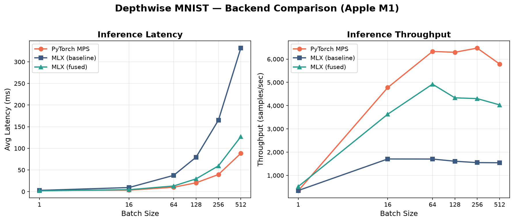
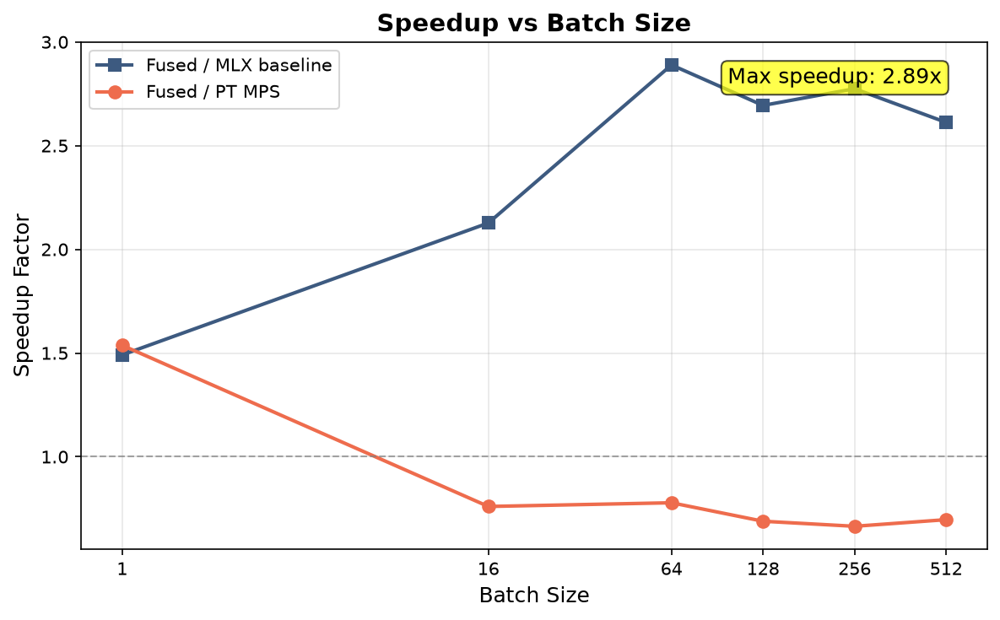
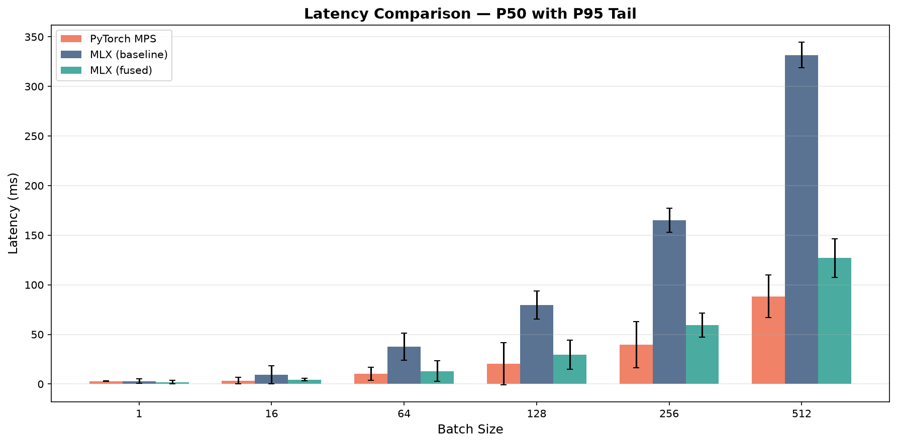
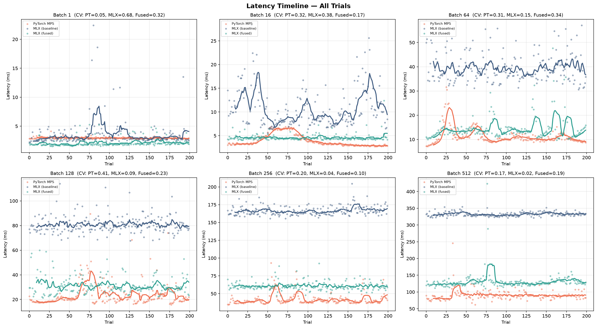
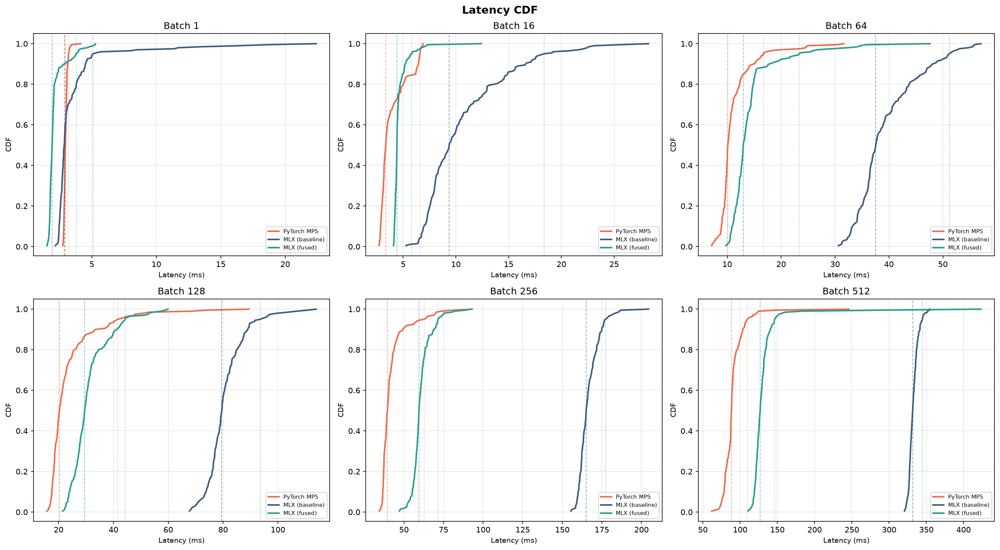
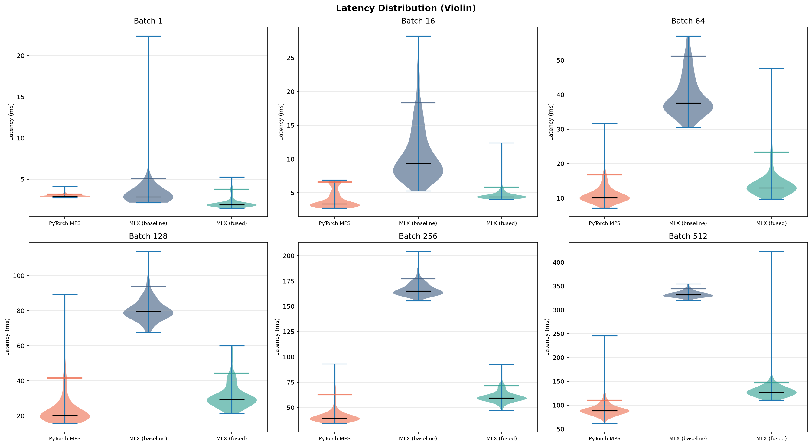
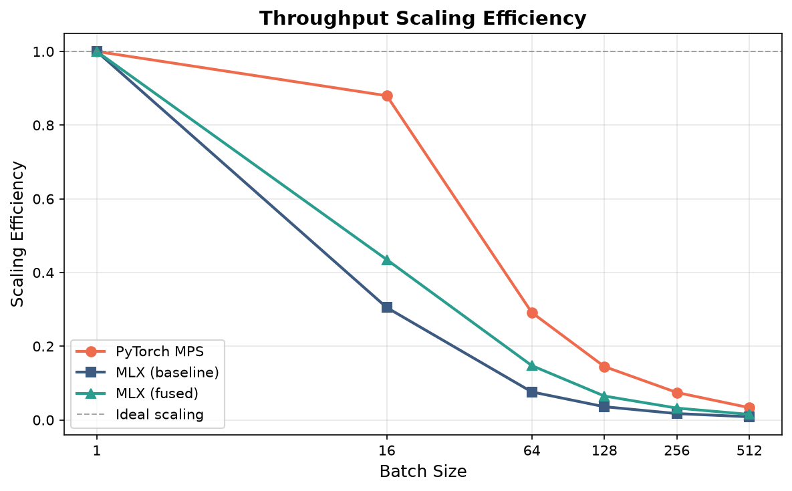

# Depthwise MNIST — Backend Comparison

**Device:** Apple M1 (8 GB) | **Model:** 101,098 params | **Input:** 1×28×28 grayscale (channel-last in MLX) | **Trials:** 200 per config | **Precision:** float32

---

## 1. Latency & Throughput

| BS | PT MPS (ms) | PT thru | MLX (ms) | MLX thru | Fused (ms) | Fused thru |
|:--:|:-----------:|:-------:|:--------:|:--------:|:----------:|:----------:|
| 1   | 2.947 | 339   | 2.858 | 350   | **1.917** | **522**   |
| 16  | **3.349** | **4,777** | 9.372 | 1,707 | 4.406 | 3,631 |
| 64  | **10.113** | **6,328** | 37.556 | 1,704 | 12.999 | 4,923 |
| 128 | **20.333** | **6,295** | 79.516 | 1,610 | 29.516 | 4,337 |
| 256 | **39.548** | **6,473** | 165.108 | 1,551 | 59.509 | 4,302 |
| 512 | **88.435** | **5,790** | 331.672 | 1,544 | 126.967 | 4,033 |

> Latency = **P50 (медиана)**, throughput = `BS / (P50 / 1000)`.

---

## 2. Speedup (Fused vs остальные)

| BS | Fused / MLX | Fused / PT |
|:--:|:-----------:|:----------:|
| 1   | **1.49×** | **1.54×** |
| 16  | 2.13× | 0.76× |
| 64  | 2.89× | 0.78× |
| 128 | 2.69× | 0.69× |
| 256 | 2.77× | 0.66× |
| 512 | 2.61× | 0.70× |

Fused kernel **быстрее MLX baseline в 1.5–2.9×** на всех BS.
PyTorch MPS остаётся лидером на BS ≥ 16 (MPS бэкенд хорошо оптимизирован под свёртки).

---

## 3. Tail Latency (P95)

| BS | PT P95 (ms) | MLX P95 (ms) | Fused P95 (ms) |
|:--:|:-----------:|:-------------:|:---------------:|
| 1   | 3.198 | 5.105 | **3.789** |
| 16  | **6.601** | 18.376 | 5.810 |
| 64  | 16.740 | 51.208 | **23.337** |
| 128 | 41.529 | 93.641 | **44.291** |
| 256 | 62.781 | 177.291 | **71.573** |
| 512 | **109.937** | 344.742 | 146.411 |

---

## 4. Variability (CV check)

| BS | PT CV | MLX CV | Fused CV |
|:--:|:-----:|:------:|:--------:|
| 1   | 4.95% | **68.31%** ⚠ | **32.34%** ⚠ |
| 16  | **32.02%** ⚠ | **38.13%** ⚠ | 16.95% ⚠ |
| 64  | **30.84%** ⚠ | 14.60% ⚠ | **33.77%** ⚠ |
| 128 | **41.22%** ⚠ | 8.72% | **22.74%** ⚠ |
| 256 | **19.99%** ⚠ | 3.90% | **10.10%** ⚠ |
| 512 | **17.22%** ⚠ | 1.87% | **19.39%** ⚠ |

MLX baseline стабилен на BS ≥ 128 (CV < 10%). PT и fused страдают от throttle на большинстве BS — вероятно, из-за thermal/power management M1.

---

## 5. Throughput Scaling Efficiency

`efficiency = throughput(BS) / (BS × throughput(1))`. 1.0 = идеальное линейное масштабирование.

| BS | PT | MLX | Fused |
|:--:|:--:|:---:|:-----:|
| 1   | 1.00 | 1.00 | 1.00 |
| 16  | 0.88 | 0.30 | 0.43 |
| 64  | 0.29 | 0.08 | 0.15 |
| 128 | 0.15 | 0.04 | 0.06 |
| 256 | 0.07 | 0.02 | 0.03 |
| 512 | 0.03 | 0.01 | 0.02 |

Все бэкенды **недобирают пропускную способность** на больших BS — модель слишком мала для насыщения GPU.

---

## 6. Теоретическая аналитика (model_profile.py)

### FLOPs на forward pass

| Слой | FLOPs | % от общего |
|:-----|:-----:|:-----------:|
| Conv1 (3×3, 1→48) | 677,376 | 4.0% |
| Stage 0 DW (3×3, s2) | 169,344 | 1.0% |
| Stage 0 PW (1×1, 48→96) | 1,806,336 | 10.7% |
| Stage 0 Skip | 1,806,336 | 10.7% |
| Stage 1 DW (3×3, s1) | 338,688 | 2.0% |
| Stage 1 PW (1×1, 96→96) | 3,612,672 | 21.4% |
| Stage 2 DW (3×3, s2) | 84,672 | 0.5% |
| Stage 2 PW (1×1, 96→192) | 1,806,336 | 10.7% |
| Stage 2 Skip | 1,806,336 | 10.7% |
| Stage 3 DW (3×3, s1) | 169,344 | 1.0% |
| Stage 3 PW (1×1, 192→192) | 3,612,672 | 21.4% |
| FC | 3,840 | 0.02% |
| **Total compute** | **15,893,952** | **94.3%** |
| Element-wise (BN+ReLU+Add) | 1,016,064 | 5.7% |
| **Grand total** | **16,910,016** | **100%** |

### Arithmetic Intensity (FLOPs/byte)

| Слой | AI (unfused) | AI (fused) | Характер |
|:-----|:-----------:|:----------:|:--------:|
| Stage 0 DW (s2) | 0.87 | 1.14 | **Memory-bound** |
| Stage 2 DW (s2) | 0.87 | 1.14 | **Memory-bound** |
| Stage 1 DW (s1) | 2.20 | 2.42 | Memory-bound |
| Stage 3 DW (s1) | 2.06 | 2.27 | Memory-bound |
| Stage 0 PW | 13.75 | — | Compute-bound-ish |
| Stage 1 PW | 19.28 | — | Compute-bound-ish |

**Ridge point M1:** ~39 FLOPs/byte → вся модель **memory-bound**. Узкое место — bandwidth, не compute.

### Параметры

| Слой | Params |
|:-----|:------:|
| Conv1 | 528 |
| Stage 0 | 10,128 |
| Stage 1 | 10,464 |
| Stage 2 | 38,688 |
| Stage 3 | 39,360 |
| FC | 1,930 |
| **Total** | **101,098** |

---

## 7. Выводы

1. **Fused kernel** стабильно быстрее MLX baseline в **1.5–2.9×** за счёт:
   - Устранения промежуточных тензоров (DW output не пишется в global memory)
   - Снижения числа Metal launch (∼8 меньше)
2. **PyTorch MPS** на BS ≥ 16 быстрее fused на **25–50%** — MPS бэкенд зрелый, fused kernel пока уступает на pointwise 1×1.
3. **CV > 10%** почти на всех BS у PT и fused — возможен thermal throttle на M1. Нужен анализ с `perf` или Metal GPU capture.
4. **Вся модель memory-bound** (AI ≪ 39 FLOPs/byte). Оптимизации:
   - **FP16** (issue #2) — 2× bandwidth, наибольший профит
   - **Fused stage целиком** (issue #9) — после FP16
5. **Pointwise 1×1** даёт ~70% FLOPs — главная цель оптимизации, не depthwise.

---

## Файлы

| Файл | Содержание |
|:-----|:-----------|
| `output/per_trial.npz` | Сырые замеры (6 BS × 3 бэкенда × 200 trials) |
| `output/benchmark_comparison.png` | Latency + Throughput |
| `output/speedup_ratio.png` | Speedup fused vs baseline/PT |
| `output/latency_timeline.png` | Per-trial scatter + rolling median |
| `output/latency_cdf.png` | Cumulative distribution |
| `output/latency_violin.png` | Violin plots per backend |
| `output/latency_bars.png` | P50 + P95 error bars |
| `output/throughput_efficiency.png` | Scaling efficiency |
| `model_profile.py` | FLOPs, AI, roofline аналитика |
