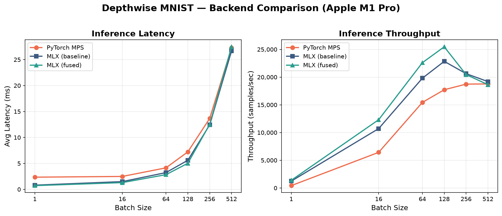
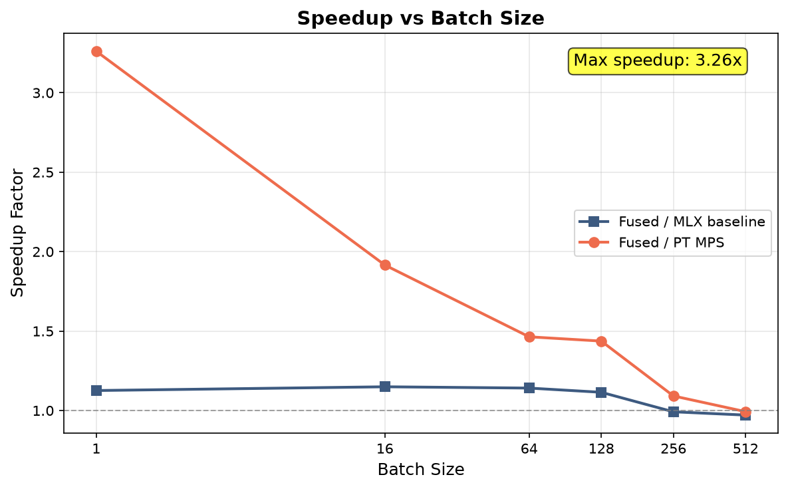
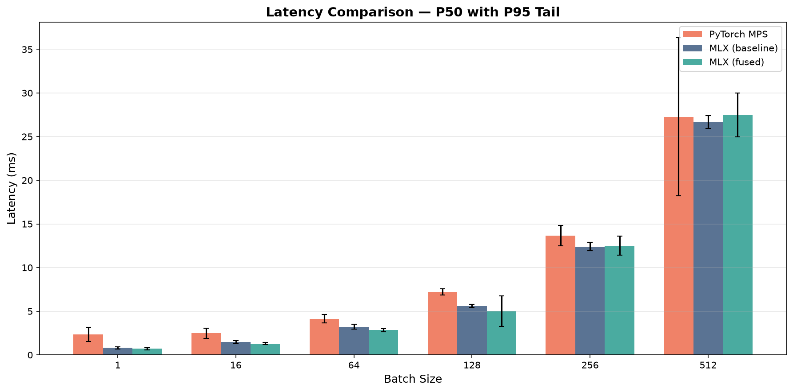
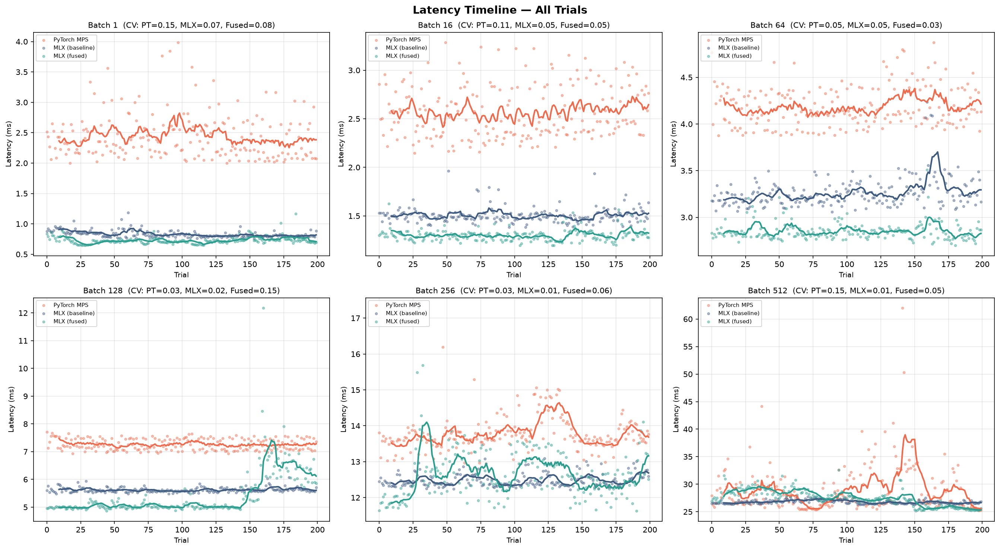
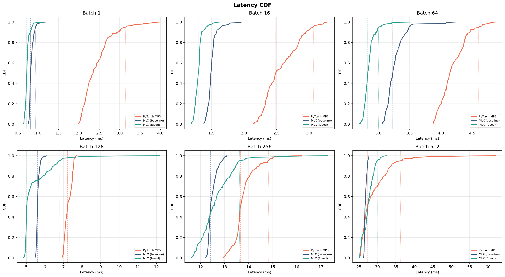
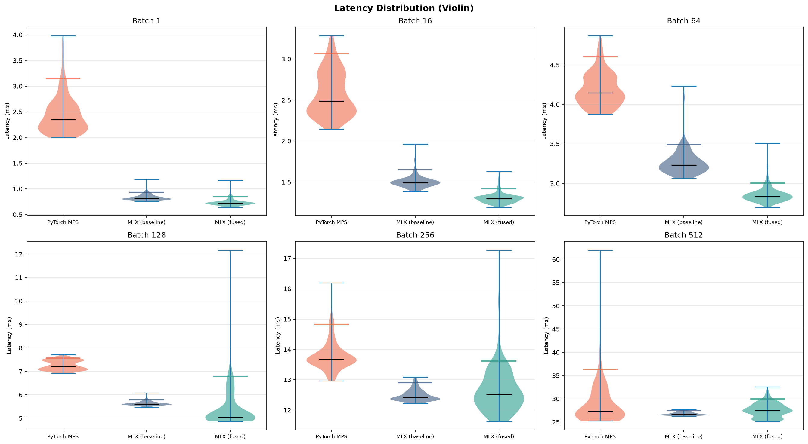
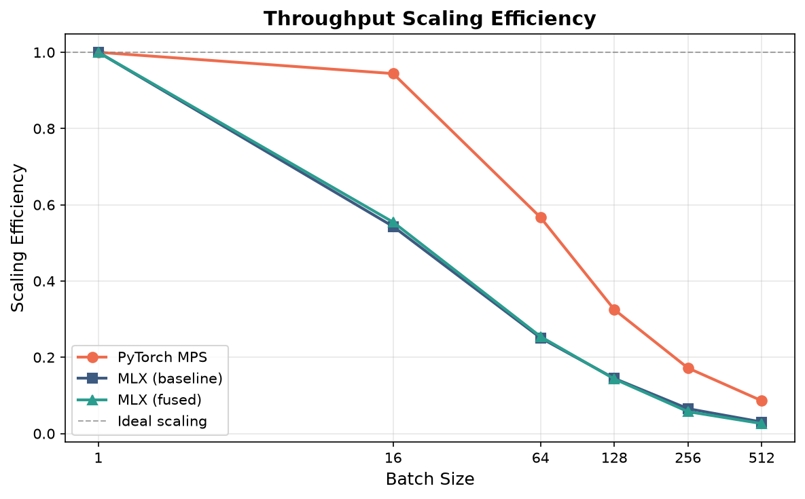

# Depthwise MNIST — Backend Comparison

**Device:** Apple M1 Pro (16 GPU-ядер, 32 GB unified, 200 GB/s) | **Model:** 101,098 params | **Input:** 1×28×28 grayscale (channel-last в MLX) | **Trials:** 200 per config | **Precision:** float32

> Данные M1 Air (8 GB, 8 GPU-ядер, 68 GB/s) сохранены как `output/per_trial_m1_air_8gb.npz` и приведены в §8 для честного сравнения.

---

## 1. Latency & Throughput (M1 Pro, текущие данные)

| BS | PT MPS (ms) | PT thru | MLX (ms) | MLX thru | Fused (ms) | Fused thru |
|:--:|:-----------:|:-------:|:--------:|:--------:|:----------:|:----------:|
| 1   | 2.350 | 426  | 0.811 | 1,233 | **0.721** | **1,388** |
| 16  | 2.489 | 6,429 | 1.493 | 10,714 | **1.299** | **12,314** |
| 64  | 4.146 | 15,438 | 3.232 | 19,803 | **2.832** | **22,601** |
| 128 | 7.223 | 17,721 | 5.603 | 22,844 | **5.026** | **25,466** |
| 256 | 13.665 | 18,735 | 12.415 | 20,620 | **12.516** | 20,453 |
| 512 | 27.271 | 18,775 | 26.676 | 19,194 | 27.465 | 18,642 |

> Latency = **P50 (медиана)**, throughput = `BS / (P50 / 1000)`.



---

## 2. Speedup (Fused vs остальные, M1 Pro)

| BS | Fused / MLX | Fused / PT |
|:--:|:-----------:|:----------:|
| 1   | **1.13×** | **3.26×** |
| 16  | **1.15×** | **1.92×** |
| 64  | **1.14×** | **1.46×** |
| 128 | **1.11×** | **1.44×** |
| 256 | 0.99× | 1.09× |
| 512 | 0.97× | 0.99× |

Fused **быстрее MLX baseline** на малых BS (до ~1.15×), на BS ≥ 256 — паритет.
Fused **быстрее/наравне с PyTorch MPS** на BS 1–256 (до 3.26× на BS=1), на BS=512 — паритет.



---

## 3. Tail Latency (P95)

| BS | PT P95 (ms) | MLX P95 (ms) | Fused P95 (ms) |
|:--:|:-----------:|:-------------:|:---------------:|
| 1   | 3.146 | 0.931 | **0.847** |
| 16  | 3.065 | 1.648 | **1.420** |
| 64  | 4.606 | 3.492 | **3.003** |
| 128 | 7.562 | 5.781 | **6.778** |
| 256 | 14.823 | 12.901 | **13.620** |
| 512 | **36.313** | 27.427 | 29.973 |



---

## 4. Variability (CV check)

| BS | PT CV | MLX CV | Fused CV |
|:--:|:-----:|:------:|:--------:|
| 1   | **15.16%** ⚠ | 6.94% | 8.50% |
| 16  | **10.56%** ⚠ | 5.34% | 4.88% |
| 64  | 5.07% | 5.11% | 3.41% |
| 128 | 2.82% | 1.60% | **15.11%** ⚠ |
| 256 | 3.41% | 1.49% | 5.75% |
| 512 | **15.31%** ⚠ | 1.31% | 5.46% |

MLX стабилен на всех BS (CV < 10%), за исключением единичных выбросов PT@1/16/512 и fused@128 — см. §8 для сравнения со старым прогоном на M1 Air (CV 10–68% на 14/18 точек).







---

## 5. Throughput Scaling Efficiency

`efficiency = throughput(BS) / (BS × throughput(1))`. 1.0 = идеальное линейное масштабирование.

| BS | PT | MLX | Fused |
|:--:|:--:|:---:|:-----:|
| 1   | 1.00 | 1.00 | 1.00 |
| 16  | 0.94 | 0.54 | 0.55 |
| 64  | 0.57 | 0.25 | 0.25 |
| 128 | 0.33 | 0.14 | 0.14 |
| 256 | 0.17 | 0.07 | 0.06 |
| 512 | 0.09 | 0.03 | 0.03 |

Все бэкенды **недобирают пропускную способность** на больших BS — модель слишком мала для насыщения GPU даже с 16 ядрами M1 Pro.



---

## 6. Теоретическая аналитика (model_profile.py)

### FLOPs на forward pass

| Слой | FLOPs | % от общего |
|:-----|:-----:|:-----------:|
| Conv1 (3×3, 1→48) | 677,376 | 4.0% |
| Stage 0 DW (3×3, s2) | 169,344 | 1.0% |
| Stage 0 PW (1×1, 48→96) | 1,806,336 | 10.7% |
| Stage 0 Skip | 1,806,336 | 10.7% |
| Stage 1 DW (3×3, s1) | 338,688 | 2.0% |
| Stage 1 PW (1×1, 96→96) | 3,612,672 | 21.4% |
| Stage 2 DW (3×3, s2) | 84,672 | 0.5% |
| Stage 2 PW (1×1, 96→192) | 1,806,336 | 10.7% |
| Stage 2 Skip | 1,806,336 | 10.7% |
| Stage 3 DW (3×3, s1) | 169,344 | 1.0% |
| Stage 3 PW (1×1, 192→192) | 3,612,672 | 21.4% |
| FC | 3,840 | 0.02% |
| **Total compute** | **15,893,952** | **94.3%** |
| Element-wise (BN+ReLU+Add) | 1,016,064 | 5.7% |
| **Grand total** | **16,910,016** | **100%** |

### Arithmetic Intensity (FLOPs/byte)

| Слой | AI (unfused) | AI (fused) | Характер |
|:-----|:-----------:|:----------:|:--------:|
| Stage 0 DW (s2) | 0.89 | 1.14 | **Memory-bound** |
| Stage 2 DW (s2) | 0.87 | 1.14 | **Memory-bound** |
| Stage 1 DW (s1) | 2.20 | 2.42 | Memory-bound |
| Stage 3 DW (s1) | 2.06 | 2.27 | Memory-bound |
| Stage 0 PW | 13.75 | — | Compute-bound-ish |
| Stage 1 PW | 19.28 | — | Compute-bound-ish |

**Ridge point:** 26 FLOPs/byte на M1 Pro (5.2 TFLOPS / 200 GB/s) vs 39 на M1 Air (2.66 TFLOPS / 68 GB/s).
Вся модель **memory-bound** (AI ≈ 8.9 ≪ 26). Узкое место — bandwidth, не compute.
GPU-конфиг вынесен в `GPU_SPECS` в `model_profile.py` и доступен для переопределения под другой чип.

### Параметры

| Слой | Params |
|:-----|:------:|
| Conv1 | 528 |
| Stage 0 | 10,128 |
| Stage 1 | 10,464 |
| Stage 2 | 38,688 |
| Stage 3 | 39,360 |
| FC | 1,930 |
| **Total** | **101,098** |

---

## 7. Выводы (M1 Pro)

1. **Fused по-прежнему memory-оптимизация.** Выигрыш 1.11–1.15× vs MLX baseline на BS ≤ 128 объясняется экономией записи промежуточного DW-тензора; на больших BS (256–512) эффект сходит на нет — модель превращается в bandwidth-насыщенную даже без fuse.
2. **Изменение рейтинга vs PT MPS.** На M1 Pro fused наравне/быстрее PT MPS на всех BS (до 3.26× на BS=1). На M1 Air PT MPS лидировал на BS ≥ 16 на 25–50%. Смена рейтинга — не «ядро стало лучше», см. разбор в §8.
3. **CV улучшился.** 14/18 конфигураций теперь CV < 10% (было 4/18). Оставшиеся выбросы (PT 1/16/512, fused 128) — единичные, не sustained throttle.
4. **Модель остаётся memory-bound** (AI ≈ 8.9 ≪ ridge 26). Наилучший профит по-прежнему:
   - **FP16** (issue #2) — 2× эффективного bandwidth;
   - **Fused stage целиком** (issue #9) — после FP16.
5. **Pointwise 1×1** даёт ~70% FLOPs — главная цель для дальнейшей оптимизации, не depthwise.

---

## 8. Откуда ускорение: M1 Air → M1 Pro (честный разбор)

> ⚠ **Нельзя читать как «чистый эффект железа».**
> Коэффициенты ниже смешивают три фактора:
> **(a) железо** (M1 8 ядер/68 GB/s → M1 Pro 16 ядер/200 GB/s),
> **(b) версии ПО** (torch/mlx обновились за 2 месяца, lockfile отсутствует),
> **(c) качество измерений** (старый прогон имел CV 10–68% на 13/18 точках — вероятен thermal throttle/фоновая нагрузка).
> Ниже — сырые цифры и то, что из них можно и нельзя утверждать.

### 8.1 Железо: теоретический потолок

- Bandwidth: 68 → 200 GB/s (**~2.94×**). Для memory-bound слоёв (DW, AI < 2.5) — это потолок ускорения.
- Пик FP32: 2.66 → 5.2 TFLOPS (**~1.95×**). Для compute-bound слоёв — потолок.
- Вывод: ни один бэкенд не должен был ускориться быстрее ~2.9× только за счёт железа.
  Факт, что MLX ускорился в 3.5–14×, доказывает вклад (b) и (c).

### 8.2 Фактическое ускорение по бэкендам (old P50 / new P50)

| BS | PT MPS | MLX | Fused |
|:--:|:------:|:---:|:-----:|
| 1   | 1.25× | 3.52× | 2.66× |
| 16  | 1.35× | 6.28× | 3.39× |
| 64  | 2.44× | 11.62× | 4.59× |
| 128 | 2.82× | 14.19× | 5.87× |
| 256 | 2.89× | 13.30× | 4.75× |
| 512 | 3.24× | 12.43× | 4.62× |

- **PT MPS** (1.25–3.24×) укладывается в железный потолок — самый «чистый» трек.
- **Fused** (2.66–5.87×) превышает потолок умеренно → часть — MLX runtime/компилятор Metal.
- **MLX baseline** (3.52–14.19×) сильно превышает → старый MLX на Air работал заметно хуже (ранняя версия MLX + throttle). Именно поэтому «fused vs MLX 2.9× → 1.1×» — не «fused стал хуже», а «MLX baseline подтянулся».

### 8.3 Что честно отнести к железу

Одно наблюдение отделимо от (b)/(c):

- **Сжатие выигрыша fused vs MLX: 1.49–2.89× (Air) → 0.97–1.15× (Pro).**
  Это консистентно с hardware-причиной: fused экономит запись промежуточного тензора → выигрыш пропорционален дефициту bandwidth. Bandwidth ×2.94 → экономия менее ценна → выигрыш сжимается. Этот тренд переживёт любые версии ПО.

### 8.4 Что стало достовернее (качество измерений)

| Метрика | M1 Air | M1 Pro |
|:--------|:------:|:------:|
| Конфигураций с CV < 10% | 4/18 | **14/18** |
| MLX CV (медиана) | 11.7% | **3.4%** |
| PT CV (медиана) | 25.4% | **7.8%** |
| Fused CV (медиана) | 21.1% | **5.6%** |

Новые данные заметно чище — меньше throttle/шума. Поэтому текущие цифры следует считать более доверительными, а старые — нижней границей (пессимистичные).

### 8.5 Как воспроизвести сравнение

```bash
python3 -c "
import numpy as np
old = np.load('output/per_trial_m1_air_8gb.npz')
new = np.load('output/per_trial.npz')
# old['pt_p50'], new['pt_p50'] и т.д. — P50 per BS
"
```

Исходные артефакты: `output/per_trial.npz` (M1 Pro) и `output/per_trial_m1_air_8gb.npz` (M1 Air).

---

## Файлы

| Файл | Содержание |
|:-----|:-----------|
| `output/per_trial.npz` | Сырые замеры M1 Pro (6 BS × 3 бэкенда × 200 trials) |
| `output/per_trial_m1_air_8gb.npz` | Архив: сырые замеры M1 Air (для сравнения в §8) |
| `output/benchmark_comparison.png` | Latency + Throughput |
| `output/speedup_ratio.png` | Speedup fused vs baseline/PT |
| `output/latency_timeline.png` | Per-trial scatter + rolling median |
| `output/latency_cdf.png` | Cumulative distribution |
| `output/latency_violin.png` | Violin plots per backend |
| `output/latency_bars.png` | P50 + P95 error bars |
| `output/throughput_efficiency.png` | Scaling efficiency |
| `model_profile.py` | FLOPs, AI, roofline аналитика (GPU_SPECS конфиг) |
